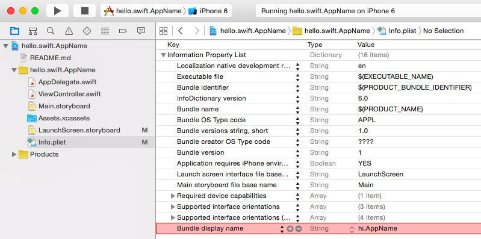

hello.swift.AppName
===================

Not App Name, It's Display Name
-------------------------------

- On file `Info.plist`, add a key `Bundle display name` and its value as display name.
    - Use 'plus' symbol-button, when you add a key.
- When you type `B` on `Info.plist`, Xcode will suggests keys.

Articles
--------

- Xcodeのプロジェクト名、Bundle Identifier、アプリ名の関係
    - http://d.hatena.ne.jp/paraches/20130211

